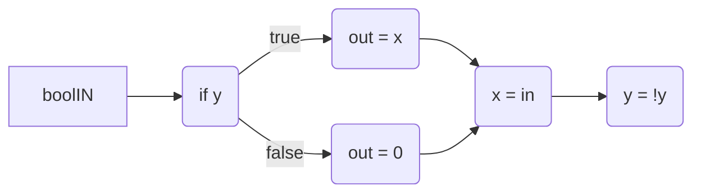
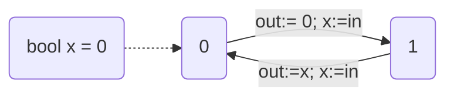

![[Pasted image 20250407143139.png]]
√

![[Pasted image 20250407143257.png]]
√

![[Pasted image 20250407143312.png]]
√

![[Pasted image 20250407143335.png]]
10 i think

![[Pasted image 20250407143345.png]]
UPPAAL says it is.

## task 2
![[Pasted image 20250407143619.png]]

What exactly happens here?

