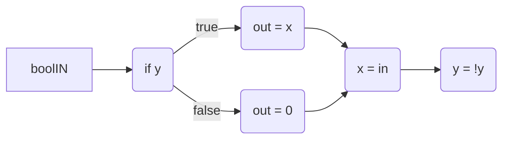
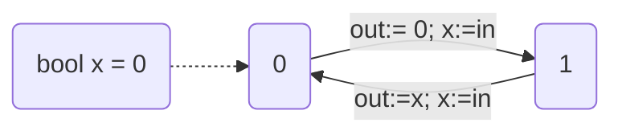

#Exercises 
![[Pasted image 20250407143139.png]]
√

![[Pasted image 20250407143257.png]]
√

![[Pasted image 20250407143312.png]]
√

![[Pasted image 20250407143335.png]]
10 i think

![[Pasted image 20250407143345.png]]
UPPAAL says it is.


## task 2
![[Pasted image 20250407143619.png]]




Valid uppaal file located  [here](pat1l1.xml) play with it to figure things out

## task 3
![[Pasted image 20250407151257.png]]
So what they are asking us to do is make a new machine thingy called a mealy machine.
Its stupid and looks like this, Where the LEFT = 0, and the RIGHT = 1
![[Pasted image 20250407174423.png]]

If you look at the **bottom left arrow** and the **top middle arrow** you can see that if you get a "1" you can either replace x value with 1 which moves us to the right, or you can keep the old x value 0 and stay at 0.

Same for the bottom right and bottom middle. If you get a "0" you can either keep x at 1, or change it to a 0.

## task 4
![[Pasted image 20250407175113.png]]


```python
if req1 == true:
	if req2 == true:
		b = choose(1,2)
		if b == 1:
			grant1
		else:
			grant2
	else:
		return grant1
else if req2 == true:
	return grant2
```


